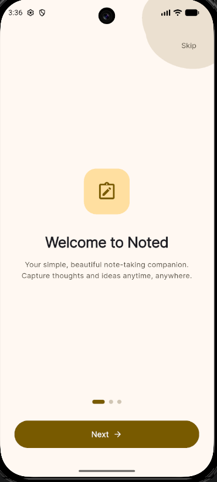
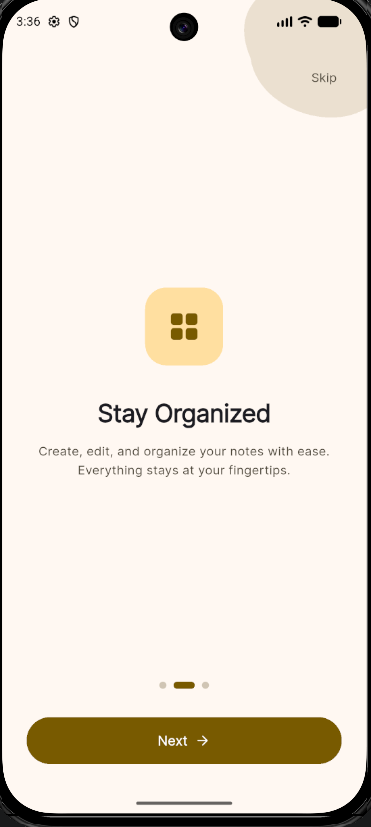
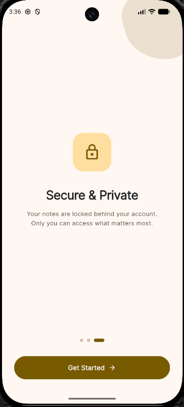
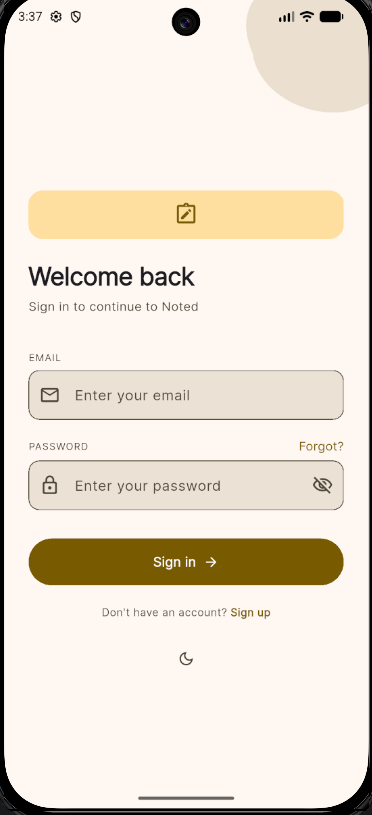
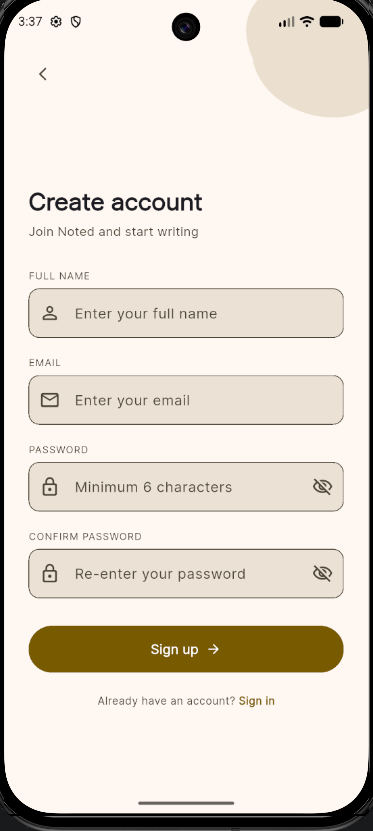
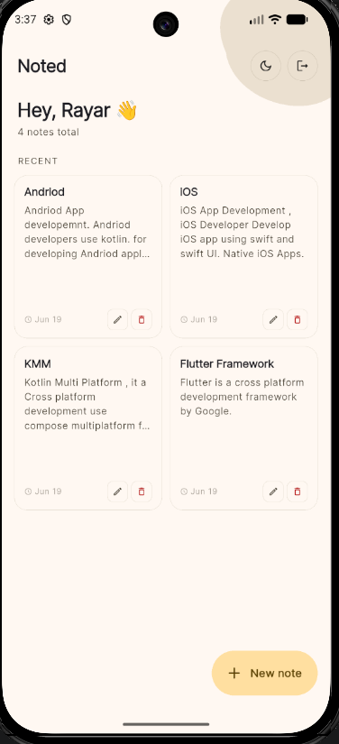
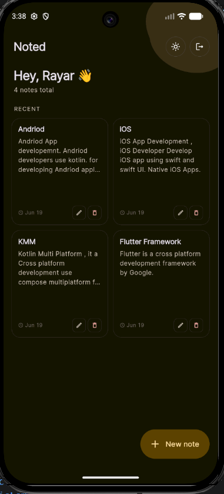
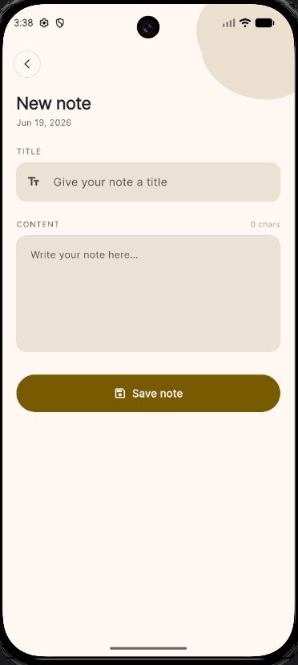
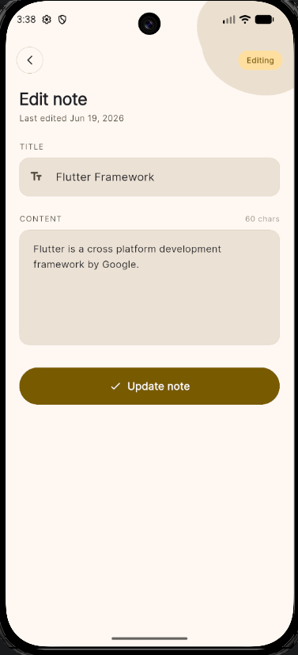
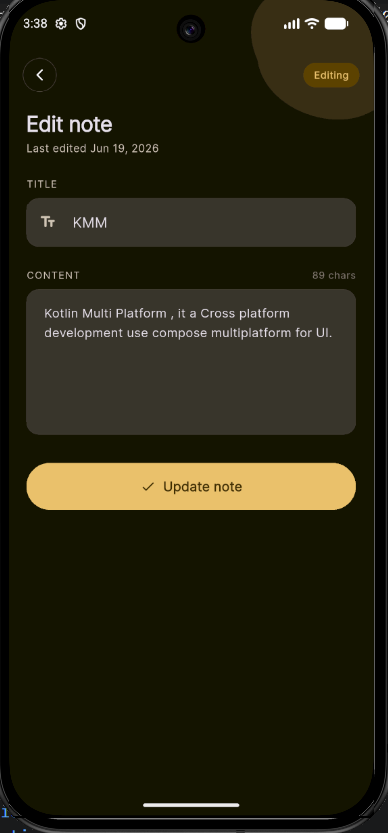

# Noted

A modern, private note-taking app built with Flutter and Firebase. Capture ideas instantly, organize them beautifully, and keep them safe behind your account.

<p align="center">
  
  
  
</p>

## Features

- **Quick Capture** — Create notes instantly with a clean editor
- **Stay Organized** — Card-based grid view with edit and delete
- **Real-Time Sync** — Powered by Cloud Firestore
- **Secure & Private** — Firebase Authentication with strict Firestore rules
- **Dark & Light Themes** — Gold/yellow accent color scheme
- **Smooth Onboarding** — 3-page intro on first launch
- **Responsive UI** — Works on phones and tablets
- **Clean Architecture** — BLoC pattern with feature-based structure

## Screenshots

### Authentication
<p align="center">
  
  
</p>

### Notes
<p align="center">
  
  
</p>

### Add / Edit
<p align="center">
  
  
  
</p>

## Tech Stack

| Layer | Technology |
|-------|-----------|
| Framework | Flutter 3.x (Dart) |
| State Management | flutter_bloc |
| Backend | Firebase (Auth + Firestore) |
| Architecture | Clean Architecture + Feature-based |
| Font | Inter (via google_fonts) |
| Icons | Material Icons |
| Local Storage | shared_preferences |

## Project Structure

```
lib/
├── core/
│   ├── constants/
│   ├── theme/
│   ├── utils/
│   └── widgets/
├── features/
│   ├── auth/
│   │   ├── bloc/
│   │   ├── data/
│   │   │   ├── actions/
│   │   │   ├── datasources/
│   │   │   ├── entities/
│   │   │   ├── models/
│   │   │   ├── repositories/
│   │   │   └── usecases/
│   │   └── presentation/
│   │       ├── screens/
│   │       └── widgets/
│   ├── notes/
│   │   ├── bloc/
│   │   ├── data/
│   │   │   ├── actions/
│   │   │   ├── datasources/
│   │   │   ├── entities/
│   │   │   ├── models/
│   │   │   ├── repositories/
│   │   │   └── usecases/
│   │   └── presentation/
│   │       ├── screens/
│   │       └── widgets/
│   └── onboarding/
│       └── presentation/
│           └── screens/
├── injection_container.dart
└── main.dart
```

## Getting Started

### Prerequisites

- Flutter SDK 3.x ([install guide](https://docs.flutter.dev/get-started/install))
- A Firebase project with Authentication and Firestore enabled

### Clone & Install

```bash
git clone https://github.com/Rayarmohan/Noted.git
cd Noted
flutter pub get
```

### Firebase Setup

1. Go to the [Firebase Console](https://console.firebase.google.com/) and create a project (or use an existing one).

2. **Enable Authentication:**
   - In your Firebase project, go to **Authentication → Sign-in method**
   - Enable **Email/Password** sign-in

3. **Enable Firestore:**
   - Go to **Firestore Database → Create database**
   - Start in production mode
   - Deploy the security rules below

4. **Register your app:**
   - **Android:** Add an Android app with package name `com.noted.rayar`, download `google-services.json`, and place it at `android/app/`
   - **iOS:** Add an iOS app with bundle ID `com.noted.rayar`, download `GoogleService-Info.plist`, and place it at `ios/Runner/`

5. **Run the app:**
   ```bash
   flutter run
   ```

### Firestore Security Rules

Deploy these rules from the Firestore console → Rules:

```js
rules_version = '2';
service cloud.firestore {
  match /databases/{database}/documents {
    match /users/{userId} {
      allow read, write: if request.auth != null && request.auth.uid == userId;

      match /notes/{noteId} {
        allow read, write: if request.auth != null && request.auth.uid == resource.data.userId;
        allow create: if request.auth != null && request.auth.uid == request.resource.data.userId;
      }
    }
  }
}
```

## Build

```bash
# Android APK
flutter build apk --release

# Android App Bundle
flutter build appbundle --release

# iOS
flutter build ios --release
```

## License

MIT
